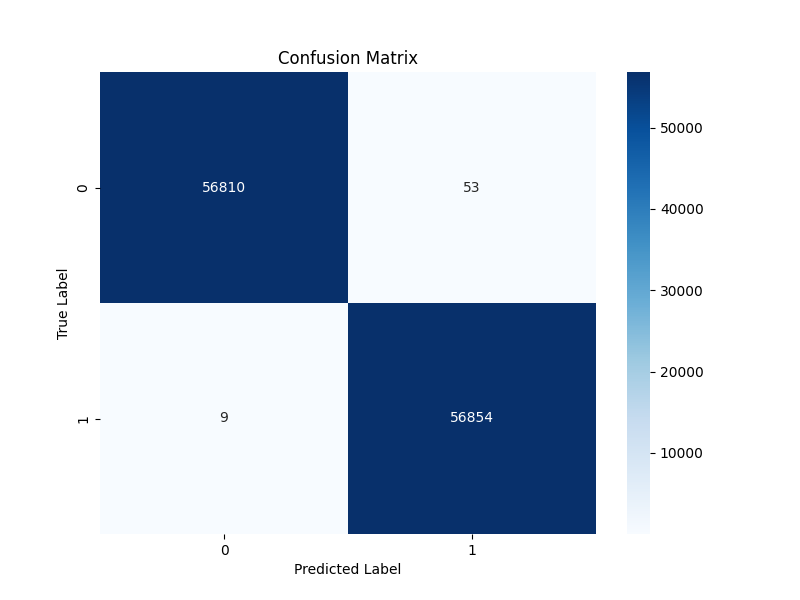
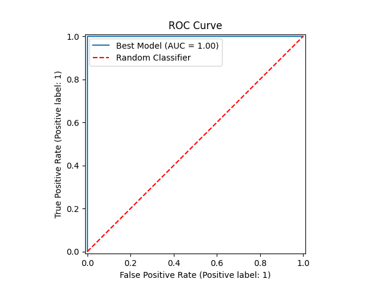

# 💳 Credit Card Fraud Detection

This project demonstrates an end-to-end **machine learning pipeline for fraud detection**.  
It uses a curated version of the popular credit card transactions dataset (`creditcard_2023.csv`, https://www.kaggle.com/datasets/nelgiriyewithana/credit-card-fraud-detection-dataset-2023), where minimal preprocessing is required, so the focus is on **model building, evaluation, and deployment** rather than data cleaning.

## 🚀 Project Structure
```
├── data/                # Contains the curated dataset
│   └── creditcard_2023.csv
├── models/              # Saved trained models (e.g., best_model.joblib)
├── results/             # Evaluation results (confusion matrix, ROC curve, metrics)
├── notebooks/           # Development notebooks (EDA, preprocessing, modeling)
│   ├── 01_eda.ipynb
│   ├── 02_preprocessing.ipynb
│   └── 03_models.ipynb
├── src/                 # Source code
│   ├── preprocessing.py # Preprocessing (scaling + PCA)
│   ├── train.py         # Model training & selection
│   ├── evaluate.py      # Model evaluation & visualization
│   ├── app.py           # Streamlit app for deployment
│   └── models/          # Custom model definitions
│       └── neural_network.py  # Neural network (Keras) implementation
```

## 🛠 Features
- **Preprocessing:** Standardization, log transform of `Amount`, and PCA dimensionality reduction  
- **Models:** Logistic Regression, Random Forest, KNN, XGBoost, and a Neural Network  
- **Evaluation:** Cross-validation, F1-score comparison, confusion matrix, and ROC curve  
- **Deployment:** Streamlit app for interactive fraud detection on uploaded data  
- **Custom Neural Network:** `src/models/neural_network.py` implements a **Keras-based classifier** that is **scikit-learn compatible** (`BaseEstimator`, `ClassifierMixin`).  
  - `fit`, `predict`, `predict_proba` methods  
  - Batch Normalization + Dropout regularization  
  - **Class imbalance** handled via dynamic `class_weight`

## 📓 Notebooks
The project includes Jupyter notebooks that document the development process:
- `01_eda.ipynb` → Exploratory Data Analysis (EDA)  
- `02_preprocessing.ipynb` → Preprocessing pipeline (scaling, PCA, log transform)  
- `03_models.ipynb` → Model training, comparison, and selection  

These notebooks served as the **backbone** for the Python modules in `src/`, making the project reproducible and production-ready.

## 📊 Example Outputs
Confusion Matrix:  


ROC Curve:  


Model Comparison: [`results/model_comparison.csv`](results/model_comparison.csv)

## ⚡ Quick Start

1. Clone this repo
   ```bash
   git clone https://github.com/yourusername/credit-fraud-detection.git
   cd credit-fraud-detection
   ```

2. Install dependencies
   ```bash
   pip install -r requirements.txt
   ```

3. Train models
   ```bash
   python src/train.py
   ```

4. Evaluate best model
   ```bash
   python src/evaluate.py
   ```

5. Run the Streamlit app
   ```bash
   streamlit run src/app.py
   ```

## 🧑‍💻 Tech Stack
- **Python 3**  
- **Libraries:** scikit-learn, XGBoost, **TensorFlow/Keras**, Streamlit, pandas, numpy, matplotlib, seaborn  
- **Modeling:** classical ML + **custom Keras neural network wrapper** compatible with sklearn workflows (CV, scoring)  
- **Workflow:** Jupyter notebooks → Python scripts → Deployment via Streamlit  

## 🎯 Purpose
This repository is designed for **practicing the entire Data Science lifecycle**:
- From preprocessing and training,  
- To evaluation and deployment.  

The dataset is already prepared, so the main focus is on **modeling and experimentation**, not cleaning or optimization.
